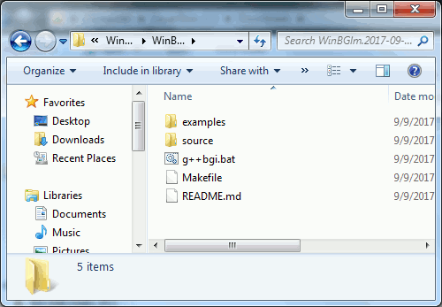

# WinBGIm (fixed, sort of)

About once a year I get a gazillion requests over at
[cplusplus.com](http://www.cplusplus.com) for the compiled version of a 
library to a relatively modern version of the old Borland BGI graphics 
library. It was and still is a pretty cool little library. It makes it 
very easy to do some basic graphics on your screen.

Unfortunately, the modern version, [WinBGIm](http://winbgim.codecutter.org/),
is broken in a couple of significant ways, but most prominently this one:

  * Neophyte C++ programmers have no idea how to fix it sufficient to get
    it to compile.

(The other issues with WinBGIm are that:

  * It only works with C++ code, not C
  * It only compiles on Windows
  * And only with MinGW
  * And only for 32-bit

But we will ignore all those other issues today.)

## Enter 2017, Stage Left

I cannot support every possible version of MinGW that exists today.
So this year I figured I’d make life just a little easier for the newbies
to build it themselves.

I’ve fixed the major problems with WinBGIm and added a proper Makefile
and a couple examples, plus a useful script to help you compile and link
your programs with libBGI.

## How to Download and Compile

Click the little “Download as Zip” button in the upper-right corner here on 
Github and unzip it somewhere convenient.

Then open up your command-prompt in the unzipped directory. The easiest way 
to do this is to double-click on the address bar in Windows Explorer, type 
“`cmd`”, and press `Enter`.

  

Once you are at the command prompt, make sure that MinGW is in the path. (If 
you installed it using the default MinGW installation, it should be.) Enter:

    g++ --version
   
This will make MinGW to tell you it is there. If it isn’t 
(`'g++' is not recognized as an internal or external command`), add it with 
_one_ of the following commands, depending on which version of MinGW you have 
installed:

    path C:\MinGW\bin;%PATH%            ←(for MinGW)
    path C:\MinGW-w64\bin;%PATH%        ←(for MinGW-w64)
    path C:\TDM-GCC-64\bin;%PATH%       ←(for TDM-GCC)

Now you are ready to compile WinBGIm and the examples. Enter:

    mingw32-make

and watch it build. You’ll also get to see the two example programs run.

## Compiling your own programs

Once the last step is complete, you now have the following files in the
directory:

    g++bgi.bat
    graphics.h
    libbgi.a

These are the only files you have to care about. Copy them to the same
directory as your program’s source code. Open the command prompt the
same way as before and make sure that MinGW is in the path. If your program’s
source code is named “`myprogram.cpp`”, compile it with:

    g++bgi myprogram.cpp

If you have multiple files that need compiling, list them too:

    g++bgi myprogram.cpp mymenu.cpp myconfigfile.cpp

Assuming you’ve made no mistakes and it compiled, you can invoke your 
executable with:

    myprogram

That’s it!

## Licensing

WinBGIm is not mine. It is currently under the care of Michael Main at the
University of Colorado. (It was written at UC, and supposedly belongs to 
them.) Mr. Main keeps his page up for us, but hasn’t touched it in years. 
(Since at least 2005?)

The `g++bgi.bat` file was written by me. I release it to the Public Domain.

The `example.cpp` example program was found online. Specifics are in the 
file itself.

The `kaleidoscope.cpp` program was also written by me. I release it to the 
Public Domain.

—Michael Thomas Greer
